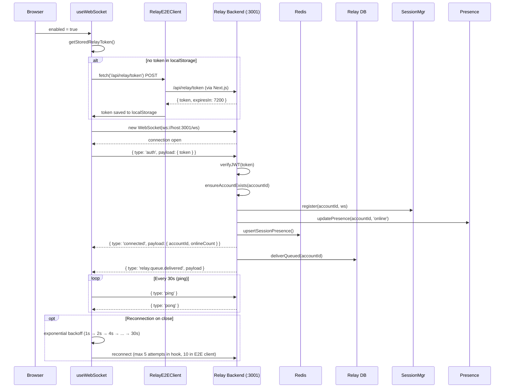
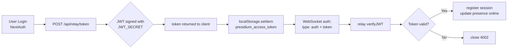
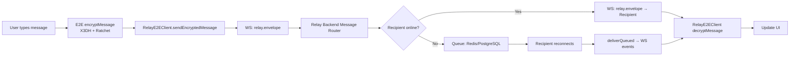
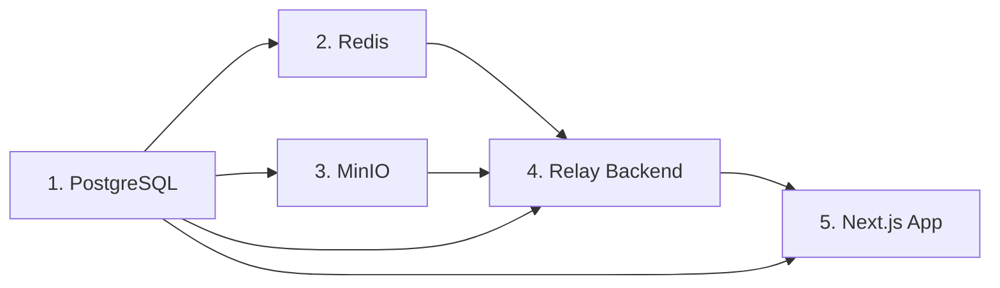

# 🔬 PRESIDIUM Technical Audit Report

> **Дата аудита:** 11 апреля 2026 г.  
> **Версия проекта:** 0.2.0  
> **Фреймворк:** Next.js 16.1.1 + React 19.0.0  
> **Runtime:** Bun 1.3.4 (relay-backend)  
> **ОС:** Windows (win32)  

---

## 📋 Executive Summary

**PRESIDIUM** — мессенджер с End-to-End шифрованием (E2E), построенный на архитектуре **Next.js (фронтенд) + Relay Backend (WebSocket signaling)**. Проект реализует **Signal Protocol**-подобную схему шифрования: X3DH (Extended Triple Diffie-Hellman) для установления сессии + Double Ratchet для шифрования сообщений.

### Ключевые факты:

| Параметр | Значение |
|----------|----------|
| Фронтенд | Next.js 16.1.1 (React 19, TypeScript 5, TailwindCSS 4) |
| Relay Backend | Bun runtime, WebSocket (`ws` 8.18.2), Prisma 6.19.2 |
| БД (Main) | SQLite (dev) / PostgreSQL (prod) — `prisma/schema.prisma` |
| БД (Relay) | SQLite (dev) / PostgreSQL (prod) — `mini-services/relay-backend/prisma/schema.prisma` |
| Кэш/Presence | Redis 7 (ioredis 5.10.1, optional) |
| Хранилище файлов | MinIO (S3-compatible) |
| Криптография | @noble/curves (Ed25519 + X25519), @noble/hashes (SHA-256, HKDF), TweetNaCl |
| Auth | NextAuth.js 4.24.11 + JWT (jsonwebtoken 9.0.3) |
| E2E Protocol | X3DH + Double Ratchet (Signal Protocol) |
| State Management | Zustand 5.0.6 + TanStack Query 5.82.0 |

### Выявленные проблемы (критичность):

| # | Проблема | Критичность | Статус |
|---|---------|-------------|--------|
| 1 | Дублирование WebSocket серверов (Next.js `/api/ws` + Relay `/ws`) | 🔴 Высокая | ⚠️ Конфликт |
| 2 | `relay-client.ts` отправляет несоответствующий формат WS сообщений | 🟡 Средняя | ⚠️ Баг |
| 3 | Отсутствие WebRTC реализации (CoTURN закомментирован) | 🟡 Средняя | ℹ️ TODO |
| 4 | `process.env.RELAY_HTTP_URL` вместо `NEXT_PUBLIC_RELAY_HTTP_URL` в relay-client | 🟡 Средняя | ⚠️ Баг |
| 5 | Приватные ключи X3DH хранятся в IndexedDB без шифрования | 🔴 Высокая | ⚠️ Уязвимость |
| 6 | JWT expiry 7 дней (relay) vs 2 часа (web→relay bridge) | 🟠 Низкая | ℹ️ Несовпадение |

---

## 🏗️ Architecture Overview

### Диаграмма сервисов (Mermaid)

```mermaid
graph TB
    subgraph "Browser / Client"
        UI[React UI Components]
        WS_Hook[useWebSocket Hook]
        E2E[RelayE2EClient + Crypto]
        ZUSTAND[Zustand Stores]
    end

    subgraph "Next.js App (Port 3000)"
        NEXTJS[Next.js Server]
        API_RELAY[/api/relay/token]
        API_WS[/api/ws → 426]
        AUTH[NextAuth.js]
    end

    subgraph "Relay Backend (Port 3001)"
        RELAY_HTTP[HTTP API Server]
        RELAY_WS[WebSocket Server /ws]
        SESSION_MGR[Session Manager]
        MSG_ROUTER[Message Router]
        PRESENCE[Presence Service]
        RATE_LIMIT[Rate Limiter]
        ANTI_SPAM[Anti-Spam]
    end

    subgraph "Infrastructure"
        DB_MAIN[(Main DB<br/>SQLite/PostgreSQL)]
        DB_RELAY[(Relay DB<br/>SQLite/PostgreSQL)]
        REDIS[(Redis<br/>Presence + Queue)]
        MINIO[(MinIO S3<br/>Media Storage)]
    end

    UI --> WS_Hook
    UI --> E2E
    WS_Hook --> E2E
    E2E --> ZUSTAND

    WS_Hook -->|WebSocket ws://host:3001/ws| RELAY_WS
    E2E -->|HTTP /api/keys/*| RELAY_HTTP
    E2E -->|POST /api/relay/token| API_RELAY
    API_RELAY --> AUTH

    API_WS -.->|426 - Moved to relay| NEXTJS

    RELAY_WS --> SESSION_MGR
    RELAY_WS --> MSG_ROUTER
    RELAY_HTTP --> AUTH
    RELAY_HTTP --> PRESENCE
    RELAY_HTTP --> RATE_LIMIT
    RELAY_HTTP --> ANTI_SPAM

    SESSION_MGR --> REDIS
    MSG_ROUTER --> REDIS
    PRESENCE --> REDIS

    RELAY_HTTP --> DB_RELAY
    RELAY_WS --> DB_RELAY

    NEXTJS --> DB_MAIN
    AUTH --> DB_MAIN

    UI -->|Media uploads| MINIO
```

### Sequence Diagram: WebSocket Connection Flow



---

## 🔌 Relay Backend Deep Dive

### Файловая структура

```
mini-services/relay-backend/
├── src/
│   ├── index.ts                          # Entry point (HTTP + WS server, 1363 lines)
│   ├── db.ts                             # Database connection helpers
│   ├── prisma.ts                         # Prisma client singleton
│   ├── utils.ts                          # Helper functions (json parser, etc.)
│   ├── auth/
│   │   └── auth-service.ts               # Register, Login, JWT, OTP, ensureAccountExists
│   ├── crypto/
│   │   └── key-bundle-service.ts         # Pre-key bundle CRUD
│   ├── presence/
│   │   └── presence-service.ts           # Online/offline/away status
│   ├── signaling/
│   │   ├── session-manager.ts            # In-memory WS session tracking
│   │   ├── message-router.ts             # Encrypted envelope routing + offline queue
│   │   └── distributed-state.ts          # Redis-backed presence + queue
│   ├── relay/
│   │   ├── contacts-service.ts           # Contacts, block/unblock, search
│   │   ├── groups-channels-service.ts    # Groups, channels, subscriptions
│   │   ├── books-service.ts              # Books library + reading progress
│   │   ├── marketplace-service.ts        # Marketplace items + transactions
│   │   ├── price-index-service.ts        # Market price index calculations
│   │   └── openclaw-report-service.ts    # Content moderation reports
│   ├── security/
│   │   ├── rate-limit-service.ts         # Token bucket rate limiter
│   │   └── anti-spam-service.ts          # Spam detection (duplicate messages)
│   └── types/
│       └── index.ts                      # TypeScript type definitions
├── prisma/
│   └── schema.prisma                     # Relay DB schema (18 models)
├── Dockerfile                            # Multi-stage Bun build
├── start.sh                              # Auto-restart script
├── package.json                          # Dependencies
└── .env.example                          # Environment variables
```

### WebSocket Protocol

**Эндпоинт:** `ws://localhost:3001/ws`

#### Auth Flow (первое сообщение после подключения)

```typescript
// Клиент отправляет:
{ type: 'auth', payload: { token: '<JWT>' }, timestamp: Date.now() }

// Сервер отвечает:
{ type: 'connected', payload: { accountId, onlineCount }, timestamp }
// или при ошибке:
{ type: 'error', payload: { message: 'Authentication required', code: 'auth_required' } }
```

**Код на сервере** (`src/index.ts`, строка ~760):
```typescript
const authenticateSocket = async (token: string): Promise<boolean> => {
  const payload = authService.verifyJWT(token);
  if (!payload) {
    ws.close(4002, 'Invalid token');
    return false;
  }
  accountId = payload.accountId;
  // Auto-provision relay account for NextAuth bridge users
  await authService.ensureAccountExists(accountId);
  sessionManager.register(accountId, ws);
  await updatePresence(accountId, 'online');
  // ... deliver queued messages
};
```

#### WebSocket Message Types

| Тип сообщения | Направление | Описание |
|--------------|-------------|----------|
| `auth` | Client → Server | Аутентификация с JWT |
| `connected` | Server → Client | Подтверждение подключения |
| `error` |双向 | Ошибка (auth, rate limit, spam, routing) |
| `ping` / `pong` |双向 | Keepalive (каждые 30s) |
| `relay.envelope` | Client → Server | Зашифрованное P2P сообщение |
| `relay.ack` | Server → Client | Подтверждение доставки |
| `relay.group_envelope` | Client → Server | Зашифрованное групповое сообщение |
| `relay.group_ack` | Server → Client | Подтверждение групповой доставки |
| `relay.channel_envelope` | Client → Server | Зашифрованное сообщение канала |
| `relay.channel_ack` | Server → Client | Подтверждение доставки в канал |
| `relay.queue.delivered` | Server → Client | Отчёт о доставке оффлайн очереди |
| `typing.start` / `typing.stop` | Client → Server | Индикатор набора текста |
| `presence.update` | Server → Client | Обновление статуса контакта |
| `message.deliver` / `message.ack` |双向 | Доставка/подтверждение (legacy) |
| `call.offer` / `call.answer` / `call.ice_candidate` / `call.hangup` | Client → Server | WebRTC сигнализация |

#### RelayEnvelope формат

```typescript
// src/types/index.ts
interface RelayEnvelope {
  type: 'message' | 'prekey' | 'call_signal';
  from: string;       // sender accountId
  to: string;         // recipient accountId
  content: string;    // JSON-serialized E2E encrypted payload
  timestamp: number;
  moderation?: {
    blocked: boolean;
    riskLevel?: 'none' | 'low' | 'medium' | 'high' | 'critical';
    flags?: Array<{ category: string; severity?: string; description?: string }>;
    source?: 'openclaw' | 'server' | 'client';
  };
}
```

### HTTP API Endpoints

#### Auth (`/api/auth/*`)

| Метод | Путь | Описание | Auth |
|-------|------|----------|------|
| POST | `/api/auth/register` | Регистрация (email + password + publicKey + preKeys) | ❌ |
| POST | `/api/auth/verify` | Верификация email (OTP код) | ❌ |
| POST | `/api/auth/login` | Логин (email + password) → JWT | ❌ |
| POST | `/api/auth/resend-otp` | Повторная отправка OTP | ❌ |
| GET | `/api/auth/me` | Текущий пользователь | ✅ |
| PUT | `/api/auth/me` | Обновление профиля (displayName, username) | ✅ |

#### Pre-Keys (`/api/keys/*`)

| Метод | Путь | Описание | Auth |
|-------|------|----------|------|
| POST | `/api/keys/upload` | Загрузка pre-key bundle | ✅ |
| GET | `/api/keys/:userId` | Получение pre-key bundle пользователя | ✅ |
| POST | `/api/keys/:userId/use` | Пометить pre-key как использованный | ✅ |
| GET | `/api/keys/:userId/count` | Количество доступных pre-keys | ✅ |

#### Contacts (`/api/contacts`)

| Метод | Путь | Описание | Auth |
|-------|------|----------|------|
| GET | `/api/contacts` | Список контактов | ✅ |
| POST | `/api/contacts` | Добавить контакт | ✅ |
| DELETE | `/api/contacts/:id` | Удалить контакт | ✅ |
| POST | `/api/contacts/:id/block` | Блокировка/разблокировка | ✅ |

#### Groups & Channels

| Метод | Путь | Описание | Auth |
|-------|------|----------|------|
| POST | `/api/groups` | Создать группу | ✅ |
| GET | `/api/groups` | Мои группы | ✅ |
| POST | `/api/groups/:id/members` | Добавить участника | ✅ |
| POST | `/api/groups/:id/leave` | Покинуть группу | ✅ |
| POST | `/api/channels` | Создать канал | ✅ |
| GET | `/api/channels` | Мои подписки | ✅ |
| GET | `/api/channels/public` | Публичные каналы | ❌ |
| POST | `/api/channels/:id/subscribe` | Подписаться | ✅ |
| POST | `/api/channels/:id/unsubscribe` | Отписаться | ✅ |

#### Marketplace, Books, OpenClaw

- `/api/books`, `/api/books/categories`, `/api/books/library`, `/api/books/:id`, `/api/books/:id/progress`
- `/api/marketplace/items`, `/api/marketplace/items/:id`, `/api/marketplace/items/:id/purchase`, `/api/marketplace/items/:id/favorite`
- `/api/marketplace/search`, `/api/marketplace/suggestions`, `/api/marketplace/price-index`
- `/api/openclaw/reports`, `/api/openclaw/reports/stats`

#### Health

| Метод | Путь | Описание |
|-------|------|----------|
| GET | `/health` | Статус сервера (connections, queue, rate limits, anti-spam) |

### JWT Authentication Flow



**Два типа JWT токенов:**

1. **Relay-native** (`generateTokens` в auth-service):
   ```json
   { "accountId": "...", "deviceId": "web", "iat": 1234567890 }
   ```
   - TTL: **7 дней** (604800 сек)
   - Используется при регистрации/логине через relay API

2. **NextAuth bridge** (`/api/relay/token` в Next.js):
   ```json
   { "sub": "...", "id": "...", "email": "...", "iat": 1234567890, "exp": 1234575090 }
   ```
   - TTL: **2 часа** (7200 сек)
   - Issuer: `presidium-web`
   - Используется при подключении через фронтенд

### Presence System

**Реализация:** `src/presence/presence-service.ts`

```typescript
export async function updatePresence(accountId: string, status: 'online' | 'away' | 'offline') {
  // 1. Обновить статус в PostgreSQL
  await prisma.account.update({ where: { id: accountId }, data: { status, lastSeen } });
  
  // 2. Получить аудиторию (контакты пользователя)
  const audience = await getPresenceAudience(accountId);
  
  // 3. Отправить event каждому контакту через WebSocket
  const event = { type: 'presence.update', payload: { accountId, status, timestamp } };
  for (const peerId of audience) {
    sessionManager.sendTo(peerId, event);
  }
}
```

**Дистрибутивное присутствие через Redis:**
- Ключ: `{relay}:session:{accountId}` → JSON с `nodeId`, `connectedAt`, `lastPing`
- TTL: `RELAY_SESSION_TTL_MS` (по умолчанию 120000 мс = 2 мин)
- Индекс: `{relay}:sessions:index` → SET всех accountId

### Offline Message Queue

**Двойная реализация:**

1. **PostgreSQL** (`OfflineMessage` модель в Prisma):
   - `fromId`, `toId`, `envelope` (JSON string), `queuedAt`, `expiresAt`, `deliveryAttempts`
   - TTL: 24 часа (`RELAY_QUEUE_TTL_MS`)
   - Лимит на получателя: 500 сообщений
   - Общий лимит: 5000 сообщений

2. **Redis** (distributed-state.ts):
   - Ключ очереди: `{relay}:queue:list:{accountId}` → RPUSH/LRANGE
   - Индекс получателей: `{relay}:queue:recipients` → SET
   - Общий счётчик: `{relay}:queue:total` → INCR

**Гибридный режим:** Если Redis доступен — используется Redis как primary, Prisma как fallback для backlog.

### Rate Limiting

**Token bucket** алгоритм (`src/security/rate-limit-service.ts`):
- HTTP endpoints: отдельные лимиты для auth, keys, contacts
- WebSocket auth: ограничение попыток аутентификации по IP
- WebSocket messages: ограничение сообщений по accountId
- Очистка устаревших bucket'ов каждые 30 сек

### Anti-Spam

**`src/security/anti-spam-service.ts`:**
- Обнаружение дубликатов сообщений (одинаковый content)
- Ограничение отправки одному получателю за временное окно
- Moderation metadata из `openclaw` (флаги контента)

---

## 🌐 Frontend Integration

### Connection Lifecycle

#### Два параллельных клиента WebSocket

**1. `useWebSocket` hook** (`src/hooks/use-websocket.ts`):
- Подключается к `NEXT_PUBLIC_RELAY_WS_URL` (по умолчанию `ws://localhost:3001/ws`)
- Token берётся из `localStorage.presidium_access_token` или через `/api/relay/token`
- Max reconnect attempts: **5** (3000ms интервал)
- Используется для UI: typing indicators, read receipts, sending messages

**2. `RelayE2EClient`** (`src/lib/crypto/relay-client.ts`):
- Отдельный singleton-клиент для E2E криптографии
- Max reconnect attempts: **10** (exponential backoff: 1s → 30s)
- Ping/Pong каждые 30s с timeout 10s
- Управляет pre-key bundle upload/fetch

#### Критичная проблема: дублирование

```
┌─────────────────────────────────────────────────────┐
│  useWebSocket hook (src/hooks/use-websocket.ts)     │
│  ─── WebSocket → relay :3001/ws                     │
│  ─── Используется UI для отправки сообщений          │
└─────────────────────────────────────────────────────┘
                          ▼
┌─────────────────────────────────────────────────────┐
│  RelayE2EClient (src/lib/crypto/relay-client.ts)    │
│  ─── Отдельный WebSocket → relay :3001/ws           │
│  ─── Используется для E2E encrypt/decrypt            │
└─────────────────────────────────────────────────────┘
```

**Проблема:** Оба клиента создают **два отдельных WebSocket соединения** к одному relay серверу. Это приводит к:
- Дублированию presence events
- Потенциальным race conditions при доставке queued messages
- Увеличению нагрузки на сервер

#### Reconnection Logic

**`useWebSocket`:**
```typescript
// Exponential backoff — НЕТ, фиксированный интервал
reconnectTimeoutRef.current = setTimeout(() => {
  connectRef.current();
}, reconnectInterval); // 3000ms — constant, NOT exponential
```

**`RelayE2EClient`:**
```typescript
// Экспоненциальный backoff — ПРАВИЛЬНАЯ реализация
const delay = Math.min(
  this.config.reconnectIntervalMs * Math.pow(2, this.reconnectAttempts - 1),
  this.config.maxReconnectIntervalMs, // 30000ms cap
);
```

### Message Flow (Send → Receive)



### State Management (Zustand)

**Stores:**

| Store | Файл | Назначение |
|-------|------|------------|
| `useAppStore` | `src/store/use-app-store.ts` | Основной store: user, chats, messages, UI state |
| `useApiStore` | `src/store/use-api-store.ts` | API request caching |
| `useLibraryStore` | `src/store/use-library-store.ts` | Книги и прогресс чтения |
| `useMarketplaceStore` | `src/store/use-marketplace-store.ts` | Marketplace items, favorites, cart |

### Error Handling

| Error Code | Значение | Действие |
|-----------|----------|----------|
| 4001 | Authentication timeout / invalid token | Clear token, attempt re-auth |
| 4002 | Invalid session / JWT | Close connection |
| `rate_limited` | Rate limit exceeded | Wait `retryAfterMs` |
| `auth_required` | Not authenticated | Send auth message |
| `invalid_envelope` | Malformed message | Log and ignore |
| `spam_blocked` | Anti-spam triggered | Show error to user |

---

## 🔐 E2E Encryption System

### Архитектура криптографии

PRESIDIUM реализует **Signal Protocol** с двумя основными компонентами:

```mermaid
graph TB
    subgraph "Identity Layer"
        ID_KEY[Identity Key Pair<br/>Ed25519]
        PREKEY[Pre-Key Bundles<br/>Signed + One-Time]
    end

    subgraph "Key Exchange (X3DH)"
        DH1[DH1: IK_A → SPK_B]
        DH2[DH2: EK_A → IK_B]
        DH3[DH3: EK_A → SPK_B]
        DH4[DH4: EK_A → OPK_B (optional)]
        KDF[HKDF-SHA256 → Shared Secret]
    end

    subgraph "Double Ratchet"
        RATCHET[Ratchet State Machine]
        SYMMETRIC[Symmetric Ratchet<br/>KDF Chain]
        DH_RATCHET[DH Ratchet<br/>New Ephemeral per msg]
    end

    subgraph "Message Encryption"
        ENCRYPT[AES-GCM-256]
        CIPHERTEXT[ciphertext + iv + tag]
    end

    ID_KEY --> DH1
    ID_KEY --> DH2
    PREKEY --> DH1
    PREKEY --> DH3
    PREKEY --> DH4

    DH1 --> KDF
    DH2 --> KDF
    DH3 --> KDF
    DH4 --> KDF

    KDF --> RATCHET
    RATCHET --> SYMMETRIC
    RATCHET --> DH_RATCHET

    SYMMETRIC --> ENCRYPT
    DH_RATCHET --> ENCRYPT
    ENCRYPT --> CIPHERTEXT
```

### X3DH Key Exchange

**Файл:** `src/lib/crypto/x3dh.ts`

**Алгоритм инициатора (Alice):**
```
DH1 = DH(IK_A, SPK_B)        // Identity Key Alice → Signed PreKey Bob
DH2 = DH(EK_A, IK_B)         // Ephemeral Key Alice → Identity Key Bob
DH3 = DH(EK_A, SPK_B)        // Ephemeral Key Alice → Signed PreKey Bob
DH4 = DH(EK_A, OPK_B)        // Ephemeral Key Alice → One-Time PreKey Bob (optional)

SK = HKDF(DH1 || DH2 || DH3 || DH4, info="Presidium X3DH Shared Secret")
```

**Конвертация ключей:** Ed25519 → X25519 (Montgomery curve conversion)
- `ed25519ToX25519PublicKey()` — для публичных ключей
- `ed25519ToX25519PrivateKey()` — для приватных ключей

**Библиотеки:** `@noble/curves/ed25519` (Ed25519 + X25519), `@noble/hashes/hkdf` (HKDF-SHA256)

### Double Ratchet

**Файл:** `src/lib/crypto/ratchet.ts`

Каждое сообщение:
1. **Symmetric ratchet:** KDF chain для обновления ключа шифрования
2. **DH ratchet:** Новый ephemeral key pair на каждое сообщение (или при получении нового от собеседника)
3. **AES-GCM-256** для шифрования контента

### Pre-Key Bundle

**Файл:** `src/lib/crypto/prekeys.ts`

```typescript
interface PreKeyBundle {
  identityKey: Uint8Array;      // Ed25519 public key
  signedPreKey: {               // Подписанный pre-key
    keyId: number;
    publicKey: Uint8Array;
    signature: Uint8Array;      // Подпись identity private key
  };
  oneTimePreKeys: Array<{       // Одноразовые pre-keys (PREKEY_COUNT = 100)
    keyId: number;
    publicKey: Uint8Array;
  }>;
}
```

**Константы:**
- `PREKEY_COUNT = 100` — количество one-time pre-keys
- `MAX_PREKEY_ID = 65535` — максимальный ID

### Key Rotation

**Файл:** `src/lib/crypto/rotation.ts`

- **Signed PreKey ротация:** каждые `SIGNED_PREKEY_ROTATION_INTERVAL` (по умолчанию 7 дней)
- **PreKey replenishment:** когда количество one-time keys < `MIN_ONE_TIME_PREKEYS`
- **Session cleanup:** сессии старше `MAX_SESSION_AGE` удаляются
- **Identity key rotation:** полная ротация identity keys (редко, только при компрометации)

### Safety Numbers & Fingerprint Verification

**Файл:** `src/lib/crypto/fingerprint.ts`

```typescript
// fingerprint = SHA-256(localIdentity || remoteIdentity) → 30 digits
const fingerprint = await generateFingerprint(localPubKey, remotePubKey);
// Format: "12345 67890 12345 67890 12345 67890"
```

**E2E Components:**

| Компонент | Файл | Описание |
|-----------|------|----------|
| `EncryptedMessageBubble` | `src/components/messenger/e2e/encrypted-message-bubble.tsx` | UI для зашифрованных сообщений |
| `EncryptionStatusBadge` | `src/components/messenger/e2e/encryption-status.tsx` | Статус шифрования в заголовке чата |
| `SafetyNumberVerification` | `src/components/messenger/e2e/safety-number-verification.tsx` | Верификация safety numbers (QR + числа) |

### Encryption Status States

| Статус | Иконка | Цвет | Описание |
|--------|--------|------|----------|
| `verified` | ShieldCheck | Emerald | Safety number верифицирован |
| `encrypted` | Lock | Gray | E2E зашифровано, не верифицировано |
| `not-encrypted` | LockOpen | Amber | Нет E2E сессии |
| `error` | ShieldAlert | Red | Ошибка шифрования |
| `initializing` | Shield (pulse) | Blue | Инициализация сессии |

### Потенциальные уязвимости

| # | Уязвимость | Описание | Риск |
|---|-----------|----------|------|
| 1 | **Нешифрованное хранение приватных ключей** | IndexedDB хранит private keys в открытом виде | 🔴 Критичный |
| 2 | **Нет key commitment verification** | При X3DH не проверяется подлинность identity key удалённого пользователя | 🟡 Средний |
| 3 | **Отсутствие forward secrecy для offline сообщений** | Queued messages хранятся в relay DB, сервер может видеть metadata | 🟡 Средний |
| 4 | **Нет deniable authentication** | JWT токены связывают личность с relay сервером | 🟡 Средний |

---

## 🗄️ Database Schema Analysis

### Main Database (Next.js)

**Файл:** `prisma/schema.prisma`  
**Provider:** SQLite (dev) / PostgreSQL (prod)

#### Модели

| Модель | Назначение | Связи |
|--------|-----------|-------|
| `User` | Профили пользователей | ChatMember, Contact, Message, FeedPost, Story, Bot, ApiKey, Webhook |
| `Account` | NextAuth OAuth аккаунты | User (1:N) |
| `Session` | NextAuth сессии (cookie-based) | User (1:N) |
| `VerificationToken` | Email verification токены | — |
| `Chat` | Чаты (private, group, channel) | Member[], Message[] |
| `ChatMember` | Участие в чатах | User, Chat |
| `Message` | Сообщения (текст + медиа метаданные) | Chat, User |
| `UserSettings` | Настройки пользователя (notif, privacy, 2FA) | User (1:1) |
| `Contact` | Контакты/избранное/заблокированные | User (owner), User (target) |
| `Bot` | Пользовательские боты | User |
| `ApiKey` | API ключи для интеграций | User |
| `Webhook` | Webhook endpoint'ы | User |
| `AIConversation` | AI диалоги | User, AIConversationMessage |
| `AIConversationMessage` | Сообщения AI диалога | AIConversation |
| `FeedPost` | Посты в ленте | User, FeedComment, FeedReaction |
| `FeedComment` | Комментарии к постам | FeedPost, User |
| `FeedReaction` | Реакции (like/dislike/repost) | FeedPost, User |
| `Story` | Stories (24h ephemeral) | User, StoryView, StoryReply |
| `StoryView` | Просмотры stories | Story, User |
| `StoryReply` | Ответы на stories | Story, User (from), User (to) |
| `PushSubscription` | Web Push подписки | User |

**Интересные особенности:**
- `Message.content` хранит **зашифрованный** текст (E2E)
- Медиа файлы: только метаданные (`mediaUrl`, `mediaType`, `mediaName`, `mediaSize`) — сами файлы в MinIO
- `Chat.isEncrypted` и `encryptionType` — флаги E2E статуса
- `Story.e2eKey`, `Story.e2eIv`, `Story.e2eTag` — параметры шифрования для stories

### Relay Database

**Файл:** `mini-services/relay-backend/prisma/schema.prisma`  
**Provider:** SQLite (dev) / PostgreSQL (prod)

#### Модели

| Модель | Назначение | Связи |
|--------|-----------|-------|
| `Account` | Релей-аккаунты (только routing metadata, БЕЗ контента) | Device, PreKeyBundle, Session, Contact, GroupMember, ChannelSubscriber |
| `Device` | Устройства пользователя | Account |
| `Session` | JWT токены relay (hashed) | Account |
| `PreKeyBundle` | Pre-keys для X3DH | Account |
| `OtpCode` | OTP коды для верификации email | Account |
| `Contact` | Контакты на уровне relay | Account (owner), Account (target) |
| `Group` | Группы | GroupMember[] |
| `GroupMember` | Участники групп | Group, Account |
| `Channel` | Каналы (broadcast) | ChannelSubscriber[] |
| `ChannelSubscriber` | Подписчики каналов | Channel, Account |
| `OfflineMessage` | Оффлайн очередь зашифрованных сообщений | — |
| `MarketplaceItem` | Товары маркетплейса | Account (seller) |
| `Transaction` | Транзакции купли-продажи | MarketplaceItem, Account (buyer), Account (seller) |
| `Favorite` | Избранные товары | Account, MarketplaceItem |
| `SearchQuery` | Поисковые запросы | Account |
| `ModerationReport` | Отчёты модерации (OpenClaw) | Account |
| `Book` | Библиотека книг | ReadingProgress[] |
| `ReadingProgress` | Прогресс чтения | Account, Book |

### Сравнение схем

| Аспект | Main DB | Relay DB |
|--------|---------|----------|
| Провайдер | SQLite → PostgreSQL | SQLite → PostgreSQL |
| Содержимое сообщений | Зашифрованный текст (E2E) | **НЕ ХРАНИТ** сообщения |
| Ключи шифрования | **НЕ ХРАНИТ** | PreKeyBundle (публичные ключи) |
| Сессии | NextAuth (cookie-based) | JWT (stateless + hashed token) |
| Offline queue | — | OfflineMessage (encrypted envelopes) |
| Marketplace | — | Полная реализация |
| Books | — | Полная реализация |
| Moderation | — | OpenClaw Reports |

### Таблица: E2E-релевантные таблицы

| Таблица | БД | E2E-связанные поля |
|---------|----|-------------------|
| `Message` | Main | `content` (encrypted), `mediaUrl` (encrypted file ref) |
| `Chat` | Main | `isEncrypted`, `encryptionType` |
| `Story` | Main | `e2eKey`, `e2eIv`, `e2eTag` |
| `PreKeyBundle` | Relay | `publicKey`, `signature`, `isUsed` |
| `OfflineMessage` | Relay | `envelope` (serialized RelayEnvelope — encrypted) |
| `Account.publicKey` | Relay | Ed25519 identity public key |

---

## ⚠️ Current Issues & Fixes

### 1. 🔴 WebSocket Reconnection Loop

**Проблема:** Два независимых WebSocket клиента к одному relay:
- `useWebSocket` hook → WS к relay
- `RelayE2EClient` → отдельный WS к relay

**Симптом:** При реконнекте оба клиента пытаются подключиться параллельно, что может вызвать:
- Race condition в session manager (два accountId на одного пользователя)
- Двойная доставка queued messages
- Конфликт presence events

**Решение:** Объединить в единый WebSocket клиент, где:
- `useWebSocket` управляет соединением
- `RelayE2EClient` использует тот же экземпляр WebSocket
- Или наоборот: E2E client как primary, hook как wrapper

**Файлы для изменения:**
- `src/hooks/use-websocket.ts`
- `src/lib/crypto/relay-client.ts`

### 2. 🟡 Format Mismatch: RelayE2EClient → Relay WS

**Проблема:** `RelayE2EClient.sendEncryptedMessage` отправляет:
```typescript
// relay-client.ts, строка ~290
this.ws!.send(JSON.stringify({
  type: 'relay.envelope',
  to: envelope.recipientId,
  payload: envelope,  // EncryptedEnvelope
}));
```

Но relay backend ожидает:
```typescript
// index.ts, строка ~1000
case 'relay.envelope': {
  const envelope = msg.payload || {};
  const to = typeof envelope.to === 'string' ? envelope.to : '';
  const content = typeof envelope.content === 'string' ? envelope.content : '';
  // envelope.to и envelope.content должны быть внутри payload
}
```

**Несоответствие:** Клиент отправляет `to` на верхнем уровне, сервер ищет `to` внутри `payload`.

**Решение:** Изменить формат в `relay-client.ts`:
```typescript
this.ws!.send(JSON.stringify({
  type: 'relay.envelope',
  payload: {
    type: 'message',
    to: envelope.recipientId,
    content: JSON.stringify(envelope),  // or whatever the E2E envelope format is
  },
}));
```

### 3. 🟡 Missing .enc Files (404)

**Проблема:** Зашифрованные файлы хранятся в `/uploads/*.enc`, но могут возвращать 404.

**Причины:**
1. Файл был удалён (disappearing messages)
2. S3/MinIO bucket не настроен
3. URL не включает decryption key
4. CORS блокирует доступ к MinIO

**Решение:** 
- Убедиться что `S3_ENDPOINT`, `S3_ACCESS_KEY`, `S3_SECRET_KEY` корректны
- Проверить что MinIO bucket `presidium` создан и доступен
- Реализовать fallback: если файл не найден — показать «File expired» вместо 404

### 4. 🟡 env Variable Mismatch in RelayE2EClient

**Проблема:**
```typescript
// relay-client.ts, строка ~110
httpBaseUrl: getRelayHttpBaseUrl(),  // Использует RELAY_HTTP_URL (не NEXT_PUBLIC_*)
wsBaseUrl: (process.env.NEXT_PUBLIC_RELAY_WS_URL || 'ws://127.0.0.1:3001')
```

`getRelayHttpBaseUrl()` проверяет `process.env.RELAY_HTTP_URL` → эта переменная **недоступна на клиенте** (нет префикса `NEXT_PUBLIC_`).

**Решение:**
```typescript
httpBaseUrl: process.env.NEXT_PUBLIC_RELAY_HTTP_URL || 'http://127.0.0.1:3001',
```

### 5. 🟠 CoTURN / WebRTC Not Implemented

**Проблема:** CoTURN service закомментирован в `docker-compose.yml`:
```yaml
# coturn:
#   image: coturn/coturn:latest
#   ...
```

**Следствие:** WebRTC звонки работают **только в локальной сети** (без NAT traversal).

**Решение:** Раскомментировать и настроить CoTURN для production, либо использовать внешний STUN/TURN сервер (например, Twilio, Xirsys).

---

## 🚀 Deployment Guide

### Порядок запуска сервисов



### Пошаговая инструкция

#### 1. Подготовка окружения

```bash
# Скопировать env файлы
cp .env.example .env.local
cp .env.production.example .env.production  # для production

# Сгенерировать секреты
openssl rand -base64 32  # для NEXTAUTH_SECRET и JWT_SECRET
openssl rand -base64 32  # для MINIO_ROOT_PASSWORD
openssl rand -base64 32  # для REDIS_PASSWORD
openssl rand -base64 32  # для DB_PASSWORD
```

#### 2. Настройка .env.local

Обязательные переменные:
```bash
# Database
DATABASE_URL="postgresql://presidium:PASSWORD@db:5432/presidium?schema=public"
DB_PASSWORD="your-password"
REDIS_PASSWORD="your-password"

# Auth
NEXTAUTH_SECRET="generated-secret"
NEXTAUTH_URL="http://localhost:3000"

# Relay
NEXT_PUBLIC_RELAY_HTTP_URL="http://localhost:3001"
NEXT_PUBLIC_RELAY_WS_URL="ws://localhost:3001/ws"
JWT_SECRET="can-reuse-NEXTAUTH_SECRET"
CORS_ORIGINS="http://localhost:3000"

# MinIO
S3_ACCESS_KEY="your-key"
S3_SECRET_KEY="your-secret"
S3_BUCKET="presidium"
MINIO_ROOT_USER="presidiumadmin"
MINIO_ROOT_PASSWORD="your-password"

# AI
GLM4_API_KEY="your-key"
AI_PROVIDER="glm4"
```

#### 3. Docker Compose

```bash
# Запустить все сервисы
docker compose up -d

# Проверить статус
docker compose ps

# Логи
docker compose logs -f app
docker compose logs -f relay
docker compose logs -f db

# Остановить
docker compose down

# С volumes (полная очистка)
docker compose down -v
```

#### 4. Database Migration

```bash
# Main DB
bun run db:push       # или db:migrate для production
bun run db:generate   # Prisma client generation

# Relay DB
bun run relay:db:push
```

#### 5. Development

```bash
# Запустить Next.js
bun run dev           # http://localhost:3000

# Запустить Relay
bun run relay:dev     # http://localhost:3001

# Или оба одновременно
bun run dev & bun run relay:dev
```

### Обязательные vs Опциональные сервисы

| Сервис | Обязательный | Назначение |
|--------|-------------|------------|
| PostgreSQL | ✅ Да | Основная БД + Relay БД |
| Next.js App | ✅ Да | Фронтенд + API |
| Relay Backend | ✅ Да | WebSocket signaling |
| Redis | ⚠️ Рекомендуется | Presence + Offline queue (fallback: Prisma) |
| MinIO | ⚠️ Рекомендуется | Медиа файлы (fallback: local storage) |
| CoTURN | ❌ Опционально | WebRTC NAT traversal |

---

## 📊 Configuration Matrix

### Frontend Environment Variables

| Переменная | Тип | По умолчанию | Описание |
|-----------|-----|-------------|----------|
| `NEXT_PUBLIC_RELAY_HTTP_URL` | URL | `http://localhost:3001` | HTTP endpoint relay backend |
| `NEXT_PUBLIC_RELAY_WS_URL` | URL | `ws://localhost:3001/ws` | WebSocket endpoint relay |
| `NEXT_PUBLIC_VAPID_PUBLIC_KEY` | String | — | Web Push VAPID public key |
| `NEXT_PUBLIC_STORAGE_QUOTA_MB` | Number | `1024` | Квота хранилища (MB) |

### Relay Backend Environment Variables

| Переменная | Тип | По умолчанию | Описание |
|-----------|-----|-------------|----------|
| `PORT` | Number | `3001` | Порт relay сервера |
| `CORS_ORIGINS` | CSV | `http://localhost:3000` | Разрешённые origins |
| `JWT_SECRET` | String | **Обязательно** | Секрет для JWT подписи |
| `DATABASE_URL` | URL | `file:./presidium.db` | URL БД relay |
| `REDIS_URL` | URL | — | Redis URL (standalone) |
| `REDIS_CLUSTER_NODES` | CSV | — | Redis cluster nodes |
| `RELAY_NODE_ID` | String | `{pid}` | ID ноды (multi-node) |
| `RELAY_SESSION_TTL_MS` | Number | `120000` | TTL presence в Redis |
| `RELAY_DEV_OTP_PREVIEW` | Boolean | `false` | Показ OTP в dev |
| `RELAY_QUEUE_PER_RECIPIENT_LIMIT` | Number | `500` | Лимит очереди на получателя |
| `RELAY_QUEUE_TOTAL_LIMIT` | Number | `5000` | Общий лимит очереди |
| `RELAY_QUEUE_TTL_MS` | Number | `86400000` | TTL сообщений в очереди (24h) |

### Next.js App Environment Variables

| Переменная | Тип | По умолчанию | Описание |
|-----------|-----|-------------|----------|
| `DATABASE_URL` | URL | `file:./dev.db` | URL основной БД |
| `NEXTAUTH_URL` | URL | `http://localhost:3000` | URL приложения |
| `NEXTAUTH_SECRET` | String | **Обязательно** | NextAuth secret |
| `JWT_SECRET` | String | — | JWT для relay (fallback: NEXTAUTH_SECRET) |
| `CORS_ORIGINS` | CSV | `http://localhost:3000` | CORS origins |
| `AI_PROVIDER` | String | `glm4` | AI provider (`glm4` / `zai`) |
| `GLM4_MODEL` | String | `glm-4.7-flash` | Модель GLM-4 |
| `GLM4_API_KEY` | String | — | GLM-4 API key |
| `ALLOW_ANON_AI` | Boolean | `true` | Разрешить AI без auth |
| `S3_ENDPOINT` | URL | `http://minio:9000` | S3/MinIO endpoint |
| `S3_ACCESS_KEY` | String | — | S3 access key |
| `S3_SECRET_KEY` | String | — | S3 secret key |
| `S3_BUCKET` | String | `presidium` | S3 bucket name |
| `NODE_ENV` | String | `development` | Среда выполнения |
| `PORT` | Number | `3000` | Порт приложения |

### Docker Compose Services Configuration

| Сервис | Port | Image | Health Check |
|--------|------|-------|-------------|
| `app` (Next.js) | 3000 | Custom (Dockerfile) | `wget localhost:3000` |
| `relay` | 3001 | Custom (Dockerfile) | `wget localhost:3001/health` |
| `db` (PostgreSQL) | 5432 | `postgres:15-alpine` | `pg_isready -U presidium` |
| `redis` | 6379 | `redis:7-alpine` | `redis-cli ping` |
| `minio` | 9000 (API), 9001 (Console) | `minio/minio:latest` | `curl /minio/health/live` |

---

## 🔧 Troubleshooting Checklist

### WebSocket не подключается

```bash
# 1. Проверить доступность relay
curl http://localhost:3001/health

# 2. Проверить WebSocket endpoint
wscat -c ws://localhost:3001/ws

# 3. Проверить CORS
curl -H "Origin: http://localhost:3000" http://localhost:3001/health

# 4. Проверить логи relay
docker compose logs relay

# 5. Проверить что relay запустился
docker compose ps | grep relay
```

### 401 Unauthorized на relay

```bash
# Проверить JWT token
curl -X POST http://localhost:3000/api/relay/token -H "Cookie: next-auth.session-token=..."

# Проверить JWT_SECRET совпадает в .env.local
grep JWT_SECRET .env.local
grep NEXTAUTH_SECRET .env.local
```

### Оффлайн очередь не доставляет

```bash
# Проверить offline messages в БД
docker compose exec relay bunx prisma db execute --stdin < check-queue.sql

# Проверить Redis
docker compose exec redis redis-cli -a $REDIS_PASSWORD keys "{relay}:queue:*"

# Статистика очереди
curl http://localhost:3001/health | jq '.offlineQueue'
```

### E2E шифрование не работает

```
1. Проверить что pre-key bundle загружен:
   GET /api/keys/{userId} с Authorization: Bearer {token}

2. Проверить что IdentityKeyPair есть в IndexedDB:
   Browser DevTools → Application → IndexedDB → E2E → identity

3. Проверить X3DH handshake:
   Console → фильтровать "[E2E]" логи

4. Если сессия не устанавливается:
   - Удалить сессию: IndexedDB → E2E → sessions → delete
   - Перезагрузить страницу (создастся новая сессия)
```

### PostgreSQL не запускается

```bash
# Проверить volumes
docker compose volumes ls

# Переинициализировать (ВНИМАНИЕ: потеря данных!)
docker compose down -v
docker compose up -d
bun run db:push
bun run relay:db:push
```

### MinIO 404 на .enc файлах

```bash
# Проверить bucket
curl http://localhost:9000/minio/health/live

# Зайти в консоль
open http://localhost:9001

# Проверить файлы
docker compose exec minio mc ls local/presidium/uploads/
```

---

## 📦 Package Versions Matrix

### Frontend (Next.js)

| Пакет | Версия | Назначение |
|-------|--------|------------|
| `next` | ^16.1.1 | Фреймворк |
| `react` | ^19.0.0 | UI библиотека |
| `react-dom` | ^19.0.0 | DOM рендерер |
| `typescript` | ^5 | Типизация |
| `@prisma/client` | ^6.11.1 | ORM |
| `prisma` | ^6.11.1 | CLI |
| `next-auth` | ^4.24.11 | Аутентификация |
| `jsonwebtoken` | ^9.0.3 | JWT |
| `zustand` | ^5.0.6 | State management |
| `@tanstack/react-query` | ^5.82.0 | Data fetching |
| `@noble/curves` | ^2.0.1 | Криптография (Ed25519/X25519) |
| `@noble/hashes` | ^2.0.1 | Хэши (SHA-256, HKDF) |
| `tweetnacl` | ^1.0.3 | Криптография (fallback) |
| `ws` | ^8.20.0 | WebSocket клиент |
| `bcryptjs` | ^3.0.3 | Хэширование паролей |
| `sharp` | ^0.34.3 | Обработка изображений |

### Relay Backend

| Пакет | Версия | Назначение |
|-------|--------|------------|
| `@prisma/client` | ^6.19.2 | ORM |
| `prisma` | ^6.19.2 | CLI |
| `argon2` | ^0.41.1 | Хэширование паролей |
| `jsonwebtoken` | ^9.0.2 | JWT |
| `ioredis` | ^5.10.1 | Redis клиент |
| `ws` | ^8.18.2 | WebSocket сервер |
| `nanoid` | ^5.1.5 | Генерация ID |
| `cors` | ^2.8.5 | CORS middleware |
| `typescript` | ^5.9.3 | Типизация |

### Infrastructure

| Сервис | Версия | Назначение |
|--------|--------|------------|
| PostgreSQL | 15-alpine | Основная БД |
| Redis | 7-alpine | Кэш / Presence |
| MinIO | latest | S3-совместимое хранилище |
| Bun | 1.3.4 | Runtime для relay |

---

## 💡 Рекомендации по улучшению

### P2P Signaling Reliability

1. **Объединить WebSocket клиенты** — создать единый `RelayWebSocketManager` который управляет подключением и предоставляет интерфейс для `useWebSocket` и `RelayE2EClient`

2. **Добавить WebSocket health checks** —定期检查 connection quality (latency, packet loss) и автоматически переключаться на backup relay

3. **Implement message deduplication** — при доставке из offline queue проверять что сообщение не было уже получено (по messageId)

4. **Add connection quality metrics** — отправлять stats (latency, reconnection count) на сервер для мониторинга

### Security Improvements

5. **Шифрование приватных ключей в IndexedDB** — использовать Web Crypto API для шифрования private keys с passphrase пользователя

6. **Implement key pinning** — при первом получении identity key — запомнить fingerprint и предупреждать при изменении (как Signal's safety numbers)

7. **Add message expiration at encryption level** — TTL внутри encrypted envelope, чтобы relay не мог прочитать время жизни сообщения

8. **Implement ratchet-only forward secrecy** — гарантировать что compromise одного ключа не раскрывает предыдущие сообщения

### Infrastructure

9. **Deploy CoTURN** — раскомментировать и настроить для production WebRTC звонков

10. **Add relay horizontal scaling** — поддержка multiple relay нод с Redis pub/sub для cross-node message routing

11. **Implement relay health dashboard** — Grafana/Prometheus для мониторинга: active connections, message throughput, queue depth, error rates

---

## 📝 Заключение

PRESIDIUM — зрелый мессенджер с полноценной реализацией **Signal Protocol** (X3DH + Double Ratchet). Архитектура разделения на фронтенд (Next.js) и signaling-сервер (Relay Backend) обеспечивает хорошую изоляцию: сервер **никогда не имеет доступа к содержимому сообщений**.

**Сильные стороны:**
- ✅ Полная E2E криптография (Signal Protocol)
- ✅ Offline message queue (Redis + PostgreSQL fallback)
- ✅ Rate limiting + Anti-spam защита
- ✅ Presence tracking с Redis distributed state
- ✅ OTP email verification
- ✅ Marketplace, Books, OpenClaw moderation

**Зоны роста:**
- ⚠️ Дублирование WebSocket клиентов
- ⚠️ Format mismatch в relay-client.ts
- ⚠️ Нешифрованное хранение private keys
- ⚠️ Отсутствие CoTURN для WebRTC
- ⚠️ Отсутствие верификации identity keys (key pinning)

---

> *Аудит выполнен на основе анализа исходного кода проекта. Все рекомендации основаны на лучших практиках реализации мессенджеров с E2E шифрованием (Signal Protocol, Matrix, WhatsApp).*
